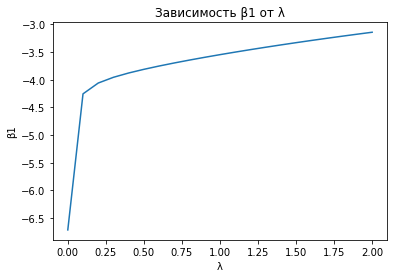
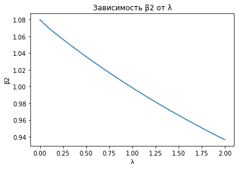
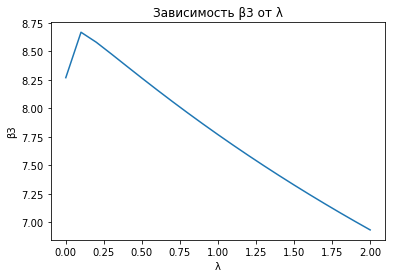
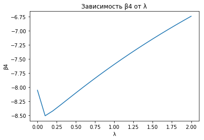

# Домашняя работа по математической статистике
**Задание 4  
Вариант 10  
Выполнил: Захаров Сергей, БПИ153  
2017**

## Часть I, МНК
Дана выборка объёма 40, элементы которой имеют признаки Y, $X_2$, $X_3$ и $X_4$.
Значения вектора Y представлены массивом ***Y_sample***, а векторов $X_2$, $X_3$ и $X_4$ – массивами ***X2_sample***, ***X3_sample*** и ***X4_sample*** соответственно. Матрица X из вектора, состоящего из единиц, и векторов X2, X3 и X4 представлена двумерным массивом ***X_sample*** (все эти значения написаны в коде программы)  
  
Предполагая, что $Y_i = \beta_1 + \beta_2 X_{2,i} + \beta_3 X_{3,i} + \beta_4 X_{4,i}$, методом наименьших квадратов (МНК) **найдём оценки коэффициентов $\beta_i$:**  
$\hat{\beta_1}$ = -6.714  
$\hat{\beta_2}$ = 1.08  
$\hat{\beta_3}$ = 8.269  
$\hat{\beta_4}$ = -8.055  
  
**Посчитаем $\hat{Y_i}$ – значения $Y_i$, оценённые регрессионной моделью** (представлены массивом ***Y_estimated***, есть в выводе программы)  
$\hat{Y_i}= \hat{\beta_1} + \hat{\beta_2} X_{2,i} + \hat{\beta_3} X_{3,i} + \hat{\beta_4} X_{4,i}$
  
Также посчитаем RSS (пригодится позже):  
RSS (сумма квадратов остатков) = $\sum_{i=0}^n (Y_i - \hat{Y_i})^2$ = 2956.1  
  
**Проверим значимость регрессии в целом:**  
$H_0$: коэффициенты при регрессорах незначимы, т.е. $\beta_2 = \beta_3 = \beta_4 = 0$  
$\alpha = 5\%$  
$F=\frac{ESS\div{(k-1)}}{RSS\div{(n-k)}}$ ~ $F_{k-1,n-k}=11.77$  
$F_{crit} = F_{\alpha,k-1,n-k}=2.866$
$F>F_{crit} \Rightarrow$ **отвергаем гипотезу**  
  
**Проверим значимость коэффициентов в отдельности:**  
$H_0: \beta_i$ незначим, т.е. $\beta_i=0$  
$\alpha = 5\%$  
$t(\beta_i) = \frac{\hat{\beta_i}}{\sqrt{\hat{\sigma^2}(\beta_i)}}$ ~ $t_{n-k}$  
$t_{crit}=T_{\alpha,n-k}=1.688$  
$t(\beta_1) = -0.087 <t_{crit} \Rightarrow$ коэффициент **незначим**  
$t(\beta_2) = 4.732 >t_{crit} \Rightarrow$ коэффициент **значим**  
$t(\beta_3) = 0.491 <t_{crit} \Rightarrow$ коэффициент **незначим**  
$t(\beta_4) = 0.429 <t_{crit} \Rightarrow$ коэффициент **незначим**  

**Проверим совместную значимость коэффициентов $\beta_3$ и $\beta_4$:**  
$H_0: \beta_3$ и $\beta_4$ совместно незначимы, т.е. $\beta_3 = \beta_4 =0$  
$\alpha = 5\%$  
$F=\frac{(RSS_r-RSS_{ur})\div{q}}{RSS_{ur}\div{(n-k)}}$ ~ $F_{q,n-k}$  
$RSS_{ur}$ – RSS полученной регрессионной модели  
$RSS_{r}$ – RSS модели с условиями $H_0$
Чтобы получить $RSS_{r}$, найдём значения $\hat{Y_{r,}}_i$:  
$\hat{Y_{r,}}_i = \hat{\beta_1} + \hat{\beta_2} X_{2,i}$ (значения представлены массивом ***Y_restricted***)  
$RSS_{r} = \sum_{i=0}^n (Y_i - \hat{Y_{r,}}_i)^2$ = 4945.167  
$F=12.112$  
$F_{crit}=3.259$  
$F>F_{crit} \Rightarrow$ **отвергаем гипотезу**  

**Построим таблицу корреляции объясняющих переменных:**  
  
|       | $X_2$ | $X_3$ | $X_4$ |
|-------|-------|-------|-------|
| $X_2$ |1      |-0.29  |-0.29  |
| $X_3$ |-0.29  |1      |0.99   |
| $X_4$ |-0.29  |0.99   |1      |

## Часть II, Ридж - регрессия
Оценки МНК при тесно коррелирующихобъясняющих переменных имеют высокую дисперсию, а значит, и низкую точность. В такой ситуации вместо обычной оценки по МНК:  
$\hat{\beta} = (X'X)^{-1}X'Y$  
может быть использована оценка т.н. ридж-регрессии:  
$\hat{\beta}_{ridge} = (X'X+D)^{-1}X'Y$,  
где *D* - некая матрица (обычно диагональная с неотрицательными элементами на главной диагонали)  
Рассмотрим частный случай ридж-регрессии:  
$\hat{\beta}_{ridge} = (X'X+\lambda I)^{-1}X'Y$
Попробуем оценить зависимость Y от $X_2$, $X_3$ и $X_4$ с помощью этой оценки, подставляя значения $\lambda$ от 0 до 2 с шагом 0.1 (полученные значения коэффициентов можно увидеть в выводе программы) и построим графики зависимости коэффициентов регрессии от $\lambda$

Заметим, что чем больше $\lambda$, тем ближе оценки коэффициентов к нулю.
