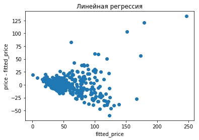
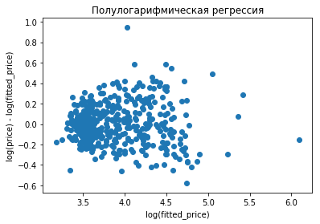
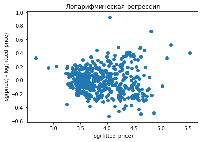
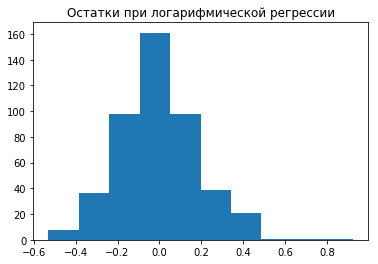
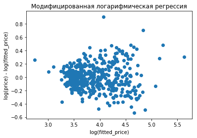
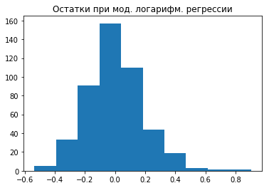

# Домашняя работа по математической статистике
**Задание 5  
Вариант 10  
Выполнил: Захаров Сергей, БПИ153  
2017**

В рамках задания было построено несколько регрессионных моделей:

## Линейная модель
**price** = $\beta_1$ + $\beta_2$· **totsp** + $\beta_3$· **dist** + $\beta_4$· **walk** + $\beta_5$· d2 + $\beta_6$· **d3** + $\beta_7$· **d4** + $\beta_8$· **bal** + $\beta_9$· **brick** + $\beta_{10}$· **floor**

МНК–оценки $\beta_i$:
<table>
<tr>
<td>$\hat{\beta_1}$ = – 33.1089 $\quad$</td>
<td>$\hat{\beta_2}$ = 1.9757</td>
</tr>
<tr>
<td>$\hat{\beta_3}$ = – 1.1385</td>
<td>$\hat{\beta_4}$ = 7.0778</td>
</tr>
<tr>
<td>$\hat{\beta_5}$ = – 15.1773</td>
<td>$\hat{\beta_6}$ = – 32.8256</td>
</tr>
<tr>
<td>$\hat{\beta_7}$ = – 50.9865</td>
<td>$\hat{\beta_8}$ = 2.0717</td>
</tr>
<tr>
<td>$\hat{\beta_9}$ = 0.8606</td>
<td>$\hat{\beta_{10}}$ = 6.6729</td>
</tr>
</table>
График зависимости остатков от прогнозов этой модели:  
  
По графику выше видно, что дисперсия остатков возрастает при увеличении прогнозов, что говорит о неподходящей функциональной форме.

## Полулогарифмическая модель
Т.к. линейная модель не подошла, было решено попробовать использовать в качестве объясняемой переменной логарифм от цены  
ln(**price**) = $\beta_1$ + $\beta_2$· **totsp** + $\beta_3$· **dist** + $\beta_4$· **walk** + $\beta_5$· **d2** + $\beta_6$· **d3** + $\beta_7$· **d4** + $\beta_8$· **bal** + $\beta_9$· **brick** + $\beta_{10}$· **floor**  
МНК–оценки $\beta_i$:
<table><tr>
<td>$\hat{\beta_1}$ = 2.8078 $\quad$</td>
<td>$\hat{\beta_2}$ = 0.0209</td>
</tr><tr>
<td>$\hat{\beta_3}$ = – 0.0163</td>
<td>$\hat{\beta_4}$ = 0.0938</td>
</tr><tr>
<td>$\hat{\beta_5}$ = 0.0381</td>
<td>$\hat{\beta_6}$ = – 0.0753</td>
</tr><tr>
<td>$\hat{\beta_7}$ = – 0.3135</td>
<td>$\hat{\beta_8}$ = 0.0534</td>
</tr><tr>
<td>$\hat{\beta_9}$ = 0.0419</td>
<td>$\hat{\beta_{10}}$ = 0.0867</td>
</tr></table>
График зависимости остатков от прогнозов этой модели:  
  
Уже гораздо лучший результат!  
$RSS$ = 17.806, $R^2_{adj}$ = 0.82

## Логарифмическая модель
В отличие от предыдущей модели, вместо **totsp** и **dist** использованы ln(**totsp**) и ln(**dist**) соответственно:  
ln(**price**) = $\beta_1$ + $\beta_2$· ln(**totsp**) + $\beta_3$· ln(**dist**) + $\beta_4$· **walk** + $\beta_5$· **d2** + $\beta_6$· **d3** + $\beta_7$· **d4** + $\beta_8$· **bal** + $\beta_9$· **brick** + $\beta_{10}$· **floor**  
МНК–оценки $\beta_i$:
<table><tr>
<td>$\hat{\beta_1}$ = – 0.9551 $\quad$</td>
<td>$\hat{\beta_2}$ = 1.3043</td>
</tr><tr>
<td>$\hat{\beta_3}$ = – 0.1359</td>
<td>$\hat{\beta_4}$ = 0.0972</td>
</tr><tr>
<td>$\hat{\beta_5}$ = – 0.1276</td>
<td>$\hat{\beta_6}$ = – 0.2371</td>
</tr><tr>
<td>$\hat{\beta_7}$ = – 0.3429</td>
<td>$\hat{\beta_8}$ = 0.0650</td>
</tr><tr>
<td>$\hat{\beta_9}$ = 0.0335</td>
<td>$\hat{\beta_{10}}$ = 0.0938</td>
</tr></table>
График зависимости остатков от прогнозов этой модели:  
  
Гистограмма остатков:  
  
По гистограмме остатков можно сделать вывод, что остатки распределены нормально.  
$RSS$ = 16.59, $R^2_{adj}$ = 0.832

## Логарифмическая модифифицированная модель
На логарифмической модели можно было бы и остановиться, но было решено поэкспериментировать с комбинациями признаков. В ходе экспериментов получилось нечто подобное:  
ln(**price**) = $\beta_1$ + $\beta_2$· ln(**totsp**) + $\beta_3$· ln(**dist**) + $\beta_4$· ln(**totsp**) · **d2** + $\beta_5$· ln(**totsp**) · **d3** + $\beta_6$· ln(**totsp**) · **d4** + $\beta_7$· **walk** + $\beta_8$· **d2** + $\beta_9$· **d3** + $\beta_{10}$· **d4** + $\beta_{11}$· **brick** · **floor** + $\beta_{12}$· **bal** + $\beta_{13}$· **floor**  
МНК–оценки $\beta_i$:
<table><tr>
<td>$\hat{\beta_1}$ = – 0.3538 $\quad$</td>
<td>$\hat{\beta_2}$ = 1.1374</td>
</tr><tr>
<td>$\hat{\beta_3}$ = – 0.1303</td>
<td>$\hat{\beta_4}$ = 0.2216</td>
</tr><tr>
<td>$\hat{\beta_5}$ = 0.2277</td>
<td>$\hat{\beta_6}$ = 0.3469</td>
</tr><tr>
<td>$\hat{\beta_7}$ = 0.0945</td>
<td>$\hat{\beta_8}$ = – 0.9279</td>
</tr><tr>
<td>$\hat{\beta_9}$ = – 1.0883</td>
<td>$\hat{\beta_{10}}$ = –1.7572</td>
</tr><tr>
<td>$\hat{\beta_{11}}$ = 0.0890</td>
<td>$\hat{\beta_{12}}$ = 0.0359</td>
</tr><tr>
<td>$\hat{\beta_{13}}$ = 0.0617</td>
</tr></table>

График зависимости остатков от прогнозов этой модели:  
  
Гистограмма остатков:  
  
$RSS$ = 16.259, $R^2_{adj}$ = 0.835

## Выводы
К сожалению, даже последняя модель очень неточная и может дать лишь приблиблизительные результаты. Тем не менее, она позволяет оценить общую картину влияния каждой характеристики квартиры на её цену. Она такова:   
• Увеличение расстояния от центра Москвы на 1% уменьшает стоимость на ~ 0.13%  
• Близость к метро увеличивает стоимость на 10%  
• Наличие балкона увеличивает стоимость на 3.66%  
• Нахождение квартиры на этаже, отличном от первого или последнего, увеличивает стоимость на 6.36%  
• Если квартира одновременно в кирпичном доме и с балконом, то стоимость увеличится на 9.31%  
• Коэффициенты $\beta_4$, $\beta_5$ и $\beta_6$ свидетельствуют о том, что, чем больше кол–во комнат в квартире, тем выше стоимость квартиры (независимо от её площади). Вкупе с коэффициентами $\beta_2$, $\beta_8$, $\beta_9$ и $\beta_{10}$ имеем следующее:  
$\quad$• Увеличение площади однокомнатной квартиры на 1% увеличит стоимость на 1.14%  
$\quad$• Увеличение площади двухкомнатной квартиры на 1% увеличит стоимость на 1.36%  
$\quad$• Увеличение площади трёхкомнатной квартиры на 1% увеличит стоимость на 1.37%  
$\quad$• Увеличение площади четырёхкомнатной квартиры на 1% увеличит стоимость на 1.49%

Напомним, что при логарифмической зависимости увеличение регрессора на 1% увеличивает прогноз в $1.01^{\beta_i}$ раз, а при полулогарифмической увеличение регрессора на единицу ведёт к увеличению прогноза в $e^{\beta_i}$ раз.

## Прогнозное значение
*totsp* = 40  
*bal* = 1  
*brick* = 1  
*floor* = 1  
*dist* = 10  
*walk* = 1  
ln(*price*) = – 0.3538 + 1.1374 · ln(40) – 0.1303 · ln(10) + 0.0945 + 0.0890 + 0.0359 + 0.0617 = 3,823  
*price* = 45.74 тыс. $\$$
